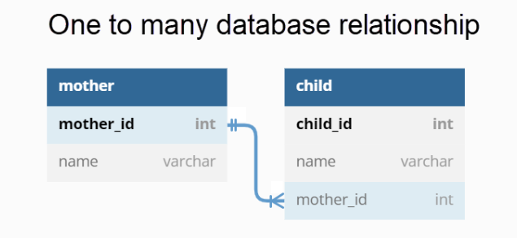
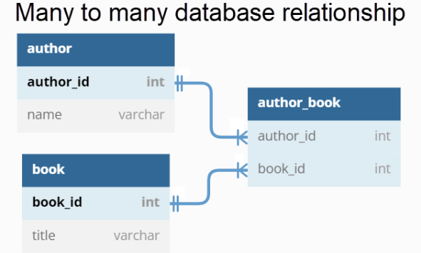
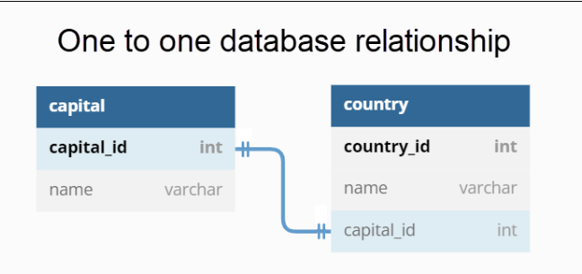
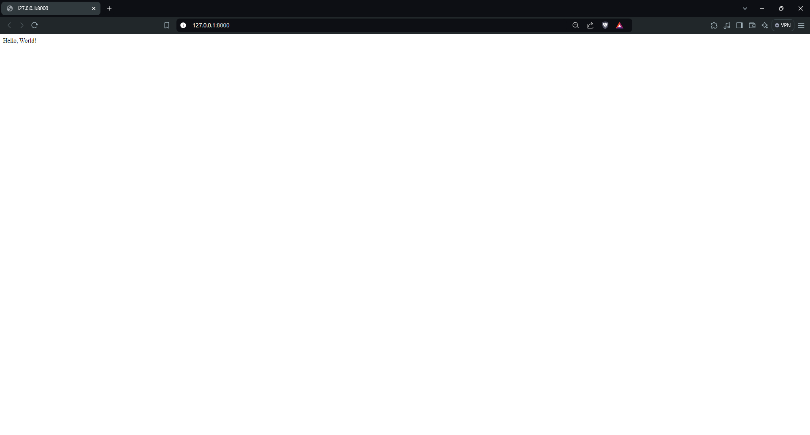

# Python in web using Django

[What is Django?](#what-is-django)
[Why Django?](#why-django)
[Django Features](#django-features)
[Django Installation](#django-installation)
[Django Project](#django-project)[Django App](#django-app)
[Django Models](#django-models)
[Django Views](#django-views)
[Django Templates](#django-templates)
[Django Admin](#django-admin)
[Django Forms](#django-forms)


### Web Development
- We need HTML, CSS, and JavaScript to create a web page.
- We need a web server to serve the web page.
- We need a database to store the data.
    - [MySQL](https://www.mysql.com/), [PostgreSQL](https://www.postgresql.org/), [SQLite](https://www.sqlite.org/), [MongoDB](https://www.mongodb.com/), etc.
- We need a server-side language to interact with the database.
- We need a framework to make the development process easier.

### What is Django?
[Django](https://www.djangoproject.com/) is a high-level Python web framework that enables rapid development of secure and maintainable websites. Built by experienced developers, it takes care of much of the hassle of web development, so you can focus on writing your app without needing to reinvent the wheel.


### Why Django?
Django is a high-level Python web framework that encourages rapid development and clean, pragmatic design. It is a free and open-source framework that follows the model-template-views architectural pattern. Django is maintained by the Django Software Foundation (DSF), an independent organization established as a 501(c)(3) non-profit.


### Django Features
- **Ridiculously fast**: Django was designed to help developers take applications from concept to completion as quickly as possible.
- **Reassuringly secure**: Django takes security seriously and helps developers avoid many common security mistakes.
- **Exceedingly scalable**: Some of the busiest sites on the Web leverage Django’s ability to quickly and flexibly scale.
- **Incredibly versatile**: Companies, organizations, and governments have used Django to build all sorts of things — from content management systems to social networks to scientific computing platforms.


### Django Installation
To install Django, simply run the following command:
```bash
pip install django
```

### Django Project
A Django project is a collection of settings for an instance of Django, including database configuration, Django-specific options, and application-specific settings. Projects can be created using the following command:
```bash
django-admin startproject projectname
```

### Django App
A Django app is a Web application that does something – e.g., a Weblog system, a database of public records, a small poll app, etc. An app can be in multiple projects. To create an app, run the following command:
```bash
python manage.py startapp appname
```

### Django Models
A model is the single, definitive source of information about your data. It contains the essential fields and behaviors of the data you’re storing. Generally, each model maps to a single database table. To create a model, define a class that inherits from `django.db.models.Model`.

Example
```python
from django.db import models

class Person(models.Model):
    first_name = models.CharField(max_length=30)
    last_name = models.CharField(max_length=30)

    def __str__(self):
        return f'{self.first_name} {self.last_name}'

```


#### Fields

- **CharField**: A field for storing character data.
- **IntegerField**: A field for storing integer data.
- **DateField**: A field for storing date data.
- **DateTimeField**: A field for storing date and time data.
- **EmailField**: A field for storing email addresses.
- **FileField**: A field for storing file uploads.
- **ImageField**: A field for storing image uploads.
- **TextField**: A field for storing large amounts of text data.

#### Relationships
- **ForeignKey**: A many-to-one relationship. Requires a positional argument: the class to which the model is related.


- **ManyToManyField**: A many-to-many relationship. Requires a positional argument: the class to which the model is related.

- **OneToOneField**: A one-to-one relationship. Requires a positional argument: the class to which the model is related.


### Django Views
A view function, or view for short, is a Python function that takes a Web request and returns a Web response. This response can be the HTML contents of a Web page, or a redirect, or a 404 error, or an XML document, or an image, etc. To create a view, define a function that takes a request object and returns a response object.

Example
```python
from django.http import HttpResponse

def hello(request):
    return HttpResponse('Hello, World!')
```
Response



### Django Templates
A template is a text file defining the structure or layout of a file (such as an HTML page), with placeholders used to represent actual content. A template can be rendered with a context to produce a final rendered output.

Example
```html
<!DOCTYPE html>
<html lang="en">
<head>
    <meta charset="UTF-8">
    <meta http-equiv="X-UA-Compatible" content="IE=edge">
    <meta name="viewport" content="width=device-width, initial-scale=1.0">
    <title>Document</title>
</head>
<body>
    <h1>Hello, World!</h1>
</body>
</html>
```

### Django Admin
Django comes with a built-in admin interface that is used to perform CRUD operations on the application's data. To use the admin interface, you need to create a superuser using the following command:

```bash
python manage.py createsuperuser
```

in app/admin.py
```python
from django.contrib import admin
from .models import Person

admin.site.register(Person)
```

### Django Forms
Django provides a Form class that is used to create HTML forms. It is used to handle HTML forms on the server side. To create a form, inherit from `django.forms.Form` or `django.forms.ModelForm`.

Example
app/forms.py

```python
from django import forms

class PersonForm(forms.Form):
    first_name = forms.CharField(max_length=30)
    last_name = forms.CharField(max_length=30)
```


apps/models.py
```python
from django.db import models

class Person(models.Model):
    first_name = models.CharField(max_length=30)
    last_name = models.CharField(max_length=30)

    def __str__(self):
        return f'{self.first_name} {self.last_name}'
```

app/forms.py
```python
from django import forms
from .models import Person

class PersonForm(forms.ModelForm):
    class Meta:
        model = Person
        fields = ['first_name', 'last_name']
```

app/views.py
```python
from django.shortcuts import render, redirect
from .forms import PersonForm

def person_form(request):
    if request.method == 'POST':
        form = PersonForm(request.POST)
        if form.is_valid():
            form.save()
            return redirect('person_form')
    else:
        form = PersonForm()
    return render(request, 'person_form.html', {'form': form})
```

app/templates/person_form.html
```html
<!DOCTYPE html>
<html lang="en">
<head>
    <meta charset="UTF-8">
    <meta http-equiv="X-UA-Compatible" content="IE=edge">
    <meta name="viewport" content="width=device-width, initial-scale=1.0">
    <title>Document</title>
</head>
<body>
    <form method="POST">
        
        {{ form.as_p }}
        <button type="submit">Submit</button>
    </form>
</body>
</html>
```
